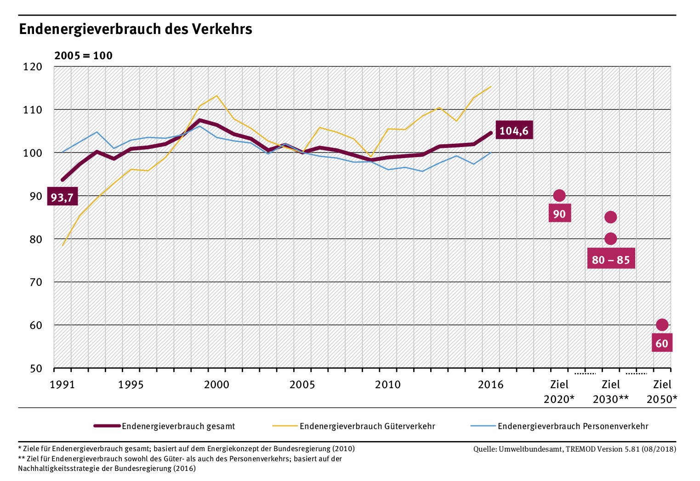
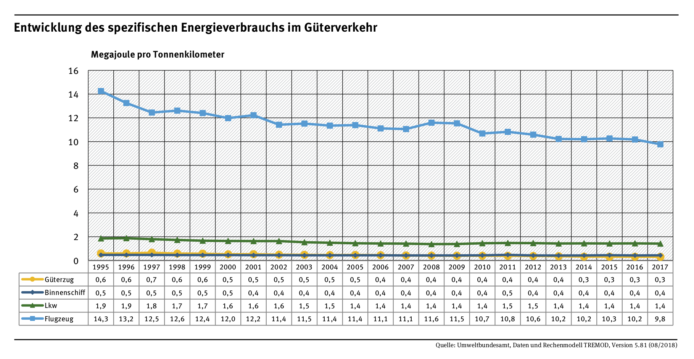

# Forschungspreis 2018

## Forschungsthema
Intelligente, vernetzte und angetriebene Güterwagen - Güterwagen 4.0

### Forscher

Prof. Dr.-Ing. Manfred Enning, Prof. Dr. Raphael Pfaff, Prof. Dr.-Ing. Bernd D. Schmidt, Daniela Wilbring BEng, Dipl.-Ing. (FH) Tim Tappert, Katharina Babilon BEng

## Kurzbeschreibung

### Wissenschaftliche/künstlerische Bedeutung

### Gesellschaftliche Relevanz

Die Bundesregierung verfolgt das Ziel, den *Endergieverbrauch* bis zum Jahr 2020 um 10% gegenüber dem Jahr 1995 bzw. bis zum Jahr 2050 um 40% gegenüber dem Jahr 1995 zu senken. Der derzeitige Entwicklungstrend ist zu diesem Ziel gegenläufig, da mit Ausnahme des Schienenverkehrs alle anderen Verkehrsträger seit 2009 einen wachsenden absoluten Endenergiebedarf aufweisen [1].

Die Zunahme des Endenergieverbrauchs trifft insbesondere auf den Güterverkehr zu, hier ist aufgrund der wirtschaftlichen Entwicklung nicht mit einer Reduzierung des Verkehrsaufkommens zu rechnen, sondern eher mit einem weiteren Wachstum. Wenn gleichzeitig entsprechend des Ziels der Bundesregierung eine Reduzierung des Endenergieverbrauchs angestrebt wird, ist es nötig, Verkehrsträger mit geringem spezifischen Energieverbrauch einen Großteil des Verkehrsaufkommens übernehmen zu lassen. Den geringsten spezifischen Endenergieverbrauch aller Verkehrsträger weist der Schienengüterverkehr auf.

Derzeit werden im Schienengüterverkehr überwiegend Massengüter versendet, da naturgemäß Zugbildung in diesem Bereich erhebliche Vorteile aufweist. Viele dieser Massengüter sind jedoch fossile Energieträger und werden in Zukunft nicht mehr transportiert werden müssen. Eine Herauforderung ist die *mass customisation*, also die Produktion kleiner Stückzahlen mit Grenzkosten einer Massenfertigung, im Schienengüterverkehr, da nur auf diesem Weg hochwertige Kaufmannsgüter ökonomisch und ökologisch vorteilhaft auf der Schiene transportiert werden können. 

### Innovationspotential

Das von der Forschergruppe entwickelte Konzept "Güterwagen 4.0" bietet durch Energieversorgung, Konnektivität, ein Betriebssystem sowie einen Antrieb des Güterwagens die Möglichkeit, hochindividualisierte Verkehre kostengünstig realisieren zu können. Das Konzept wurde in umfangreichen Gesprächen mit Stakeholder-Gruppen, wie beispielsweise Güterbahnen, Hafen- und Anschlussbahnbetreiber, Fahrzeughersteller und -vermieter sowie Zulassungsbehörden erarbeitet.

Das Konzept beinhaltet

- wirtschaftliche Analyse der Problemfelder der Stakeholder,
- technische Lösungsansätze,
- arbeitswissenschaftliche und betriebliche Bedürfnisse sowie
- ein Migrationsszenario.

In einem geförderten Projekt werden bis Mitte 2021 in Zusammenarbeit mit DB Systemtechnik, Wascosa, Lenord und Bauer sowie Reuschling Demonstratoren auf Grundlage von Güterwagen entwickelt, aufgebaut und erprobt.

### Profilbildung der Fachhochschule Aachen

#### Ausgewählte Veröffentlichungen

Bernd D. Schmidt, Manfred Enning, Raphael Pfaff. Güterwagen 4.0 - Der Güterwagen für das Internet der Dinge. Teil 3: Einführungsszenarien für aktive, kommunikativeGüterwagen. ETR - EisenbahntechnischeRundschau, 67(5):60– 64, 2018

Raphael Pfaff, Manfred Enning. Die nachhaltige Alternative zum autonomen Lastwagen. Deine Bahn, (10):22 – 26, 2017

Manfred Enning, Raphael Pfaff. Güterwagen 4.0 - Der Güterwagen für das Internet der Dinge. Teil 1: Gesamtsystembetrachtung und grundlegendes Konzept. ETR - Eisenbahntechnische Rundschau, 66(1/2):12 – 16, 2017

Raphael Pfaff, Parham Shahidi, Manfred Enning. Connected freight rail rolling stock: a modular approach integrating sensors, actors and cyber physical systems for operational advantages and condition based maintenance. Asia-Pacific Conference of the Prognostics and Health Management Society, Jeju, Korea, pages 1 – 7, 2017

Parham Shahidi, Raphael Pfaff, Manfred Enning. The connected wagon - a concept for the integration of vehicle side sensors and actors with cyber physical representation for condition based maintenance. First International Conference on Rail Transportation, Chengdu, China, pages 1 – 8, 2017

Raphael Pfaff, Bernd D. Schmidt, Manfred Enning. Towards inclusion of the freight rail system in the industrial internet of things - wagon 4.0. Stephenson Conference, London, United Kingdom, pages 1 – 10, 2017

#### Quellen

[1] Endenergieverbrauch und Energieeffizienz des Verkehrs, Bericht des Umweltbundesamtes (2018), https://www.umweltbundesamt.de/daten/verkehr/endenergieverbrauch-energieeffizienz-des-verkehrs